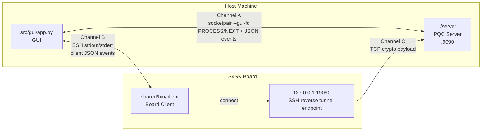

# PQC Demo Architecture

This document explains how the current deployment works in both board mode and local mode.

## Setup Diagram

```
 HOST MACHINE (WSL/Linux)                          S4SK BOARD (192.168.0.5)
┌─────────────────────────────────────┐           ┌──────────────────────────────┐
│                                     │           │                              │
│  ┌───────────────┐                  │           │  ┌────────────────────────┐  │
│  │ src/gui/app.py│                  │           │  │ shared/bin/client      │  │
│  │     (GUI)     │                  │           │  │    (Board Client)      │  │
│  └──┬─────┬──────┘                  │           │  └───────────┬────────────┘  │
│     │     │                         │           │              │               │
│     │     │  Channel B              │           │              │               │
│     │     │  SSH stdout/stderr      │    SSH    │              │               │
│     │     └─────────────────────────╂───────────╂──────────────┘               │
│     │        (client JSON events)   │           │                              │
│     │                               │           │                              │
│     │  Channel A                    │           │  ┌────────────────────────┐  │
│     │  Unix socketpair (--gui-fd)   │           │  │  127.0.0.1:19090      │  │
│     │  JSON events + PROCESS/NEXT   │           │  │  (tunnel endpoint)    │  │
│     │                               │           │  └───────────▲────────────┘  │
│  ┌──▼──────────┐                    │           │              │               │
│  │  ./server   │                    │           │    Channel C │               │
│  │ (PQC Server)│                    │           │    TCP crypto payload        │
│  │  :9090      ◄────────────────────╂───────────╂──────────────┘               │
│  └─────────────┘  SSH reverse tunnel│           │                              │
│                   -R 19090:127.0.0.1:9090       │                              │
└─────────────────────────────────────┘           └──────────────────────────────┘

  Channel A ── GUI ↔ Server   : socketpair fd, JSON control (PROCESS / NEXT)
  Channel B ── GUI ↔ Client   : SSH stdout pipe, client JSON events
  Channel C ── Client → Server: TCP crypto payload, routed via SSH reverse tunnel
```

## 1. Components

- Host machine (WSL/Linux)
- Runs the GUI (`src/gui/app.py`) and server binary (`./server`).
- S4SK board
- Runs the board client binary (`/home/root/PQC-DEMO-Chandru/shared/bin/client`) through SSH.

## 2. Runtime Channels

There are three distinct channels:

- Channel A: GUI <-> Server control/event channel
- Transport is Unix socketpair (`--gui-fd`) created by `src/gui/app.py`.
- Purpose is server JSON events and GUI commands (`PROCESS`, `NEXT`).

- Channel B: GUI <-> Board process channel
- Transport is SSH stdout/stderr pipe.
- Purpose is client JSON event streaming to the GUI.

- Channel C: Client <-> Server crypto channel
- Logical transport is TCP (PQC payload path).
- In board mode, the TCP path is carried through SSH reverse tunnel for reliability:
  - GUI launches SSH with `-R 19090:127.0.0.1:<PQC_PORT>`
  - Board client connects to `127.0.0.1:19090`
  - Tunnel forwards that traffic back to host server `127.0.0.1:<PQC_PORT>`.

## 2.1 Simple Flow (Test Environment)

Use this simplified view in presentations when you need a clean board-mode test path.



Test sequence (simple):

1. GUI starts server with `--gui-fd`.
2. GUI launches board client over SSH with reverse tunnel `-R 19090:127.0.0.1:9090`.
3. Client sends crypto payload to `127.0.0.1:19090` on board.
4. SSH tunnel forwards payload to host server on `127.0.0.1:9090`.
5. GUI receives progress events from server (Channel A) and client logs/events (Channel B).

## 3. Why Reverse Tunnel Is Used

Direct board -> host TCP to WSL can be inconsistent depending on host networking and firewall behavior.
Using SSH reverse tunneling keeps communication reliable while still preserving TCP semantics for the client/server protocol.

## 4. End-to-End Flow (Interactive Mode)

1. App startup
- GUI starts server with `--gui-fd`.
- Server emits `gui_connected`, `listening`, `ecdh_keygen`, `kyber_pk_loaded`, `phase=keys_ready`.

2. First drag: Server Keys -> Vehicle
- GUI launches board client over SSH (with reverse tunnel).
- Client receives server keys, computes ECDH/Kyber, derives hybrid key, encrypts message, sends bundle.
- Server emits `phase=bundle_received` and waits for GUI command `PROCESS`.

3. Second drag: Client Bundle -> Server
- GUI sends `PROCESS` over the socketpair control channel.
- Server runs decapsulation/decrypt path, emits `ecdh_derive`, `kyber_decap`, `hybrid_key`, `decrypt`, `complete`.

4. Reset / next round
- GUI sends `NEXT` and server generates a new key round.

## 5. Local Mode vs Board Mode

- Board mode (`./run.sh` with empty `LOCAL_CLIENT`)
- Uses SSH + reverse tunnel and runs client on S4SK.

- Local mode (`cd local && ./run.sh`)
- Runs local x86 client binary directly, no board required.

## 6. Configuration (config.env)

- `SERVER_IP`
- Host IP identity for documentation/diagnostics.
- `BOARD_IP`, `BOARD_USER`, `BOARD_CLIENT_PATH`
- Board-side launch target.
- `PQC_PORT`
- Crypto TCP protocol port for server/client.
- `GUI_PORT`
- Legacy TCP GUI-report port (kept for compatibility in server codepaths).
- `LOCAL_CLIENT`
- If set, bypasses board SSH and runs local client binary.

## 7. Troubleshooting Quick Map

- Stuck at "BUNDLE RECEIVED"
- This is expected until second drag (Client Bundle -> Server) sends `PROCESS`.

- No client logs after first drag
- Check SSH path and board client launch in `src/gui/tmp/client.log`.

- Server waiting forever
- Check `src/gui/tmp/server_stderr.log` for `Waiting for GUI command: PROCESS`.

- Need proof board is really used
- Run board proof command and confirm `BOARD_HOST:s4sk` and JSON events:

```bash
ssh -o ConnectTimeout=5 -o ConnectionAttempts=1 -o BatchMode=yes \
    -o ExitOnForwardFailure=yes -o StrictHostKeyChecking=no \
    -R 19090:127.0.0.1:9090 root@192.168.0.5 \
    'echo BOARD_HOST:$(hostname); /home/root/PQC-DEMO-Chandru/shared/bin/client 127.0.0.1 --json --port 19090 --msg verify'
```
