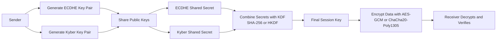

# Hybrid Cryptography Flow (Easy View)

**Why hybrid?**
- ECDHE gives strong, fast classical security today.
- Kyber adds post-quantum protection against future quantum attacks.
- Combining both means an attacker must break both paths to recover the session key.
